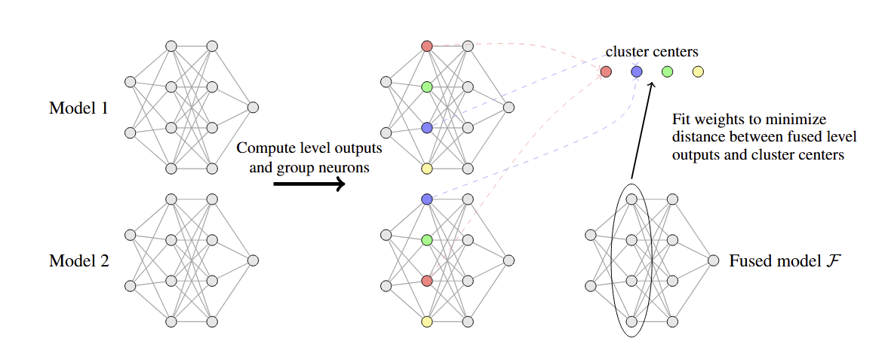

# Model Fusion via Neuron Interpolation




---

## Table of Contents

* [Repository Structure](#repository-structure)
* [Setting up the Project](#setting-up-the-project)
* [Fusion](#fusion)
* [Training Base Models](#training-base-models)
* [Evaluation](#evaluation)

---

## Repository Structure
```
Deep-Learning-Project-Model-Fusion/
├── example-base-modes/         # Pretrained Models to fuse with!
├── models/                      # Neural network architectures (MLP, VGG, ViT)
├── main_scripts/
│   ├── run_individual_algorithms/   # Scripts for running single fusion methods
│   ├── experiments_code/
│   │   ├── fusion/                  # Core fusion experiment scripts
│   │   ├── training/                # Scripts for model training and fine-tuning
│   │   ├── jinja_templates/         # Templates for generating latex tables from .json files
│   │   ├── individual_train_scripts # Base model train-script for each architecture
│   └── ablation_studies/            # Scripts for neuron importance & ablation experiments
├── fusion_algorithms/           # Core implementation of each fusion algorithm
├── utils/                       # Utility modules for datasets, training, model mgmt, etc.
├── plots/                       # Placeholder directory for plots to be saved
```

---

## Setting up the project

To run the cide, first a virtual environment with python 3.12 has to be created. Then, requirements can be installed with:
```bash
pip install -r requirements.txt
```

All scripts can be run directly from the project root directory, so make sure it's on `PYTHONPATH` (after activating the venv):
```bash
export PYTHONPATH="<abspath_to_root>:$PYTHONPATH"
```

---

## Fusion

To fuse trained models, we can either use individual fusion scripts, or run the full-suite to reproduce the reported results in the paper. We note that pretrained models are available in the [example-base-models](example-base-models) directory for experimentation.

- Individual fusion algorithms can be ran like so:
  - KF Gradient Fusion:
    ```bash
    python main_scripts/run_individuals_algorithms/run_alf.py --help
    ```
  - HF/KF Linear Fusion:
    ```bash
    python main_scripts/run_individuals_algorithms/run_hf_kf.py --help
    ```
  - OTFusion:
    ```bash
    python main_scripts/run_individuals_algorithms/run_otf.py --help
    ```
  - Git Re-Basin
    ```bash
    python main_scripts/run_individuals_algorithms/run_gr.py --help
    ```

  Every script has it's own CLI arguments, and the `--help` flag can be used to display them along with helpful explanatory messages.

  For example, KF Gradient Fusion can be run like so:

  - Full-dataset ViTs on CIFAR-100:
    ```bash
    python main_scripts/run_individual_algorithms/run_alf.py \
      --model_savedir example-base-models/full-dataset/ViTs/CIFAR-100 \
      --device cuda \
      --num_fusion_samples 5000 \
      --plot_path plots/iid-vits.png \
      --run_last_layer_kd \
      --use_kl_kd_on_head \
      --verbose
    ```
  - Sharded ViTs on CIFAR-100:
    ```bash
    python main_scripts/run_individual_algorithms/run_alf.py \
      --model_savedir example-base-models/sharded/ViTs/CIFAR-100/split-by-2/seed1 \
      --device cuda \
      --num_fusion_samples 5000 \
      --plot_path plots/sharded-vits.png \
      --run_last_layer_kd \
      --use_kl_kd_on_head \
      --verbose
    ```
  - Non-IID VGGs on CIFAR-10 (note that these VGGs are composed of 9 levels):
    ```bash
    python main_scripts/run_individual_algorithms/run_alf.py \
      --model_savedir example-base-models/non-iid/VGGs/CIFAR-10/split-by-4/seed1 \
      --device cuda \
      --num_fusion_samples 400 \
      --plot_path plots/non-iid-vggs.png \
      --optimizer_per_level sgd,sgd,sgd,sgd,sgd,sgd,sgd,sgd,adam \
      --lr_per_level 0.0001,0.0001,0.0001,0.0001,0.0001,0.0001,0.0001,0.0001,0.001 \
      --weight_perturbation_per_level 0 \
      --run_last_layer_kd \
      --use_kl_kd_on_head \
      --verbose
    ```

- To reproduce results from the paper, the full fusion suite has to be run. It is quite straightforward, and can be done by adapting and running each individual experiment-fusion script in [main_scripts/experiments_code/fusion](main_scripts/experiments_code/fusion). E.g., to fuse ViT base models, the user can run
  ```bash
  python3 main_scripts/experiments_code/fusion/fuse_all_vits.py
  ```
  Before this script is run, the desired setting has to (unfortunately) be hard-coded in the main function. This sums up to changing 4-5 lines of code, to specify which models need to be fused.

---


## Training Base Models

To replicate the base models used in the paper, we provide individual scripts for every model type. These have hard-coded arguments, but they should run out-of-the-box. Slight adaptation of the scripts (i.e. few lines of code) is needed to distinguish between base models for the `full-dataset`, `non-iid` and `sharded` cases. Models will by default be saved in the `base-models` directory. The commands to run them are:

- ViTs:
  ```bash
  python main_scripts/experiments_code/training/train_all_vits.py
  ```

- VGGs:
  ```bash
  python main_scripts/experiments_code/training/train_all_vggs.py
  ```

- MLPs:
  ```bash
  python main_scripts/experiments_code/training/train_all_mlps.py
  ```

The training procedure is not exactly the same for every model/dataset. More details regarding the hyperparams and training settings can be found in the individual train scripts, e.g. [vit_generic_train.py](main_scripts/experiments_code/individual_train_scripts/vit_generic_train.py).

Given that we run multiple seeds to get mean/std for results, these scripts taka a while to run. To ease quick experimentation, some base models have been uploaded in [example-base-models](example-base-models).

For the full-dataset setup (sometimes referred to as ''iid'' in the codebase), a finetuning phase must follow after the training of base models. This can be done by running the following script:
```bash
python main_scripts/experiments_code/training/finetune_models.py
```

---


## Evaluation

Once base models have been trained and fused, we can test each one individually on the test set. This can be done by simply running the eval script, which also needs 5 lines of code adaptation to reflect the desired setting:

```bash
python main_scripts/experiments_code/evaluate_all_models.py
```

This script will generate `.json` files that contains values for specified metrics, and in the end it will also generate an aggregated `.json` file that contains mean/std values for these metrics.
